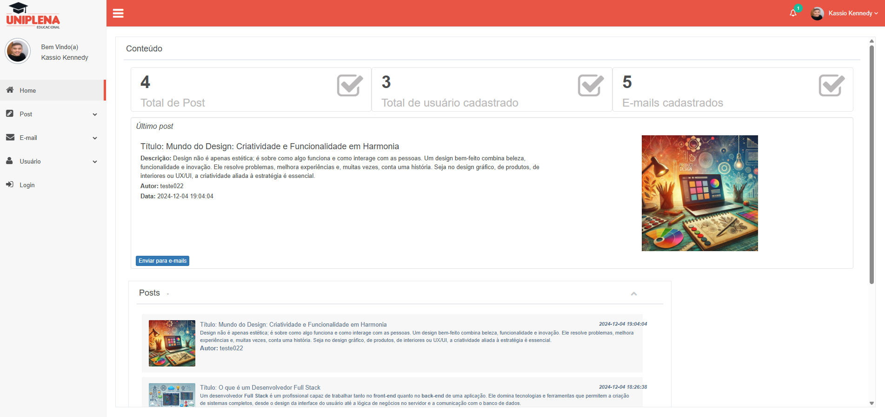
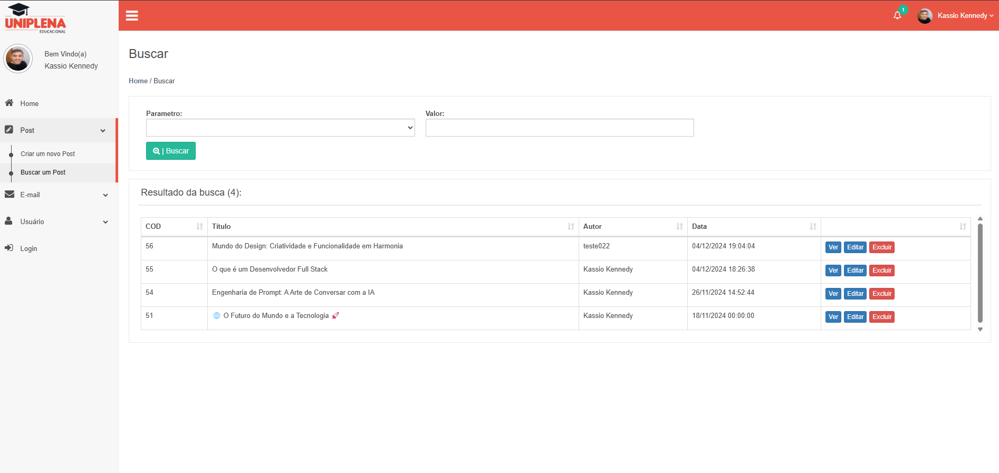
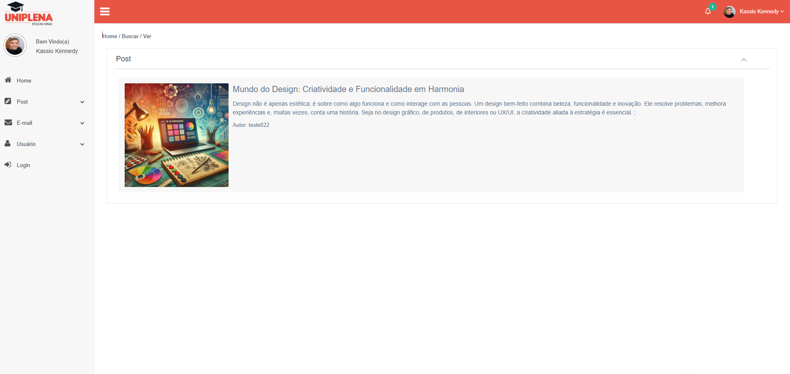

#  Projeto Integrador em Engenharia de Software - PIT 2
 
 Projeto feito para empresa que trabalho e já aproveitei a oportunidade para fazer o da faculdade também. A ideia do projeto e um CRM, um blog do lado do ADM. 

<h3>Tela de login do CRM</h3>

<h3>Home - CRM</h3>

<h3>Criando um Post</h3>

<h3>Buscando um post por parâmetro</h3>

<h3>Visualizando um post</h3>

A lógica para Adicionar / Buscar / Ver / Editar / Excluir segue para os outros módulos também.
 

