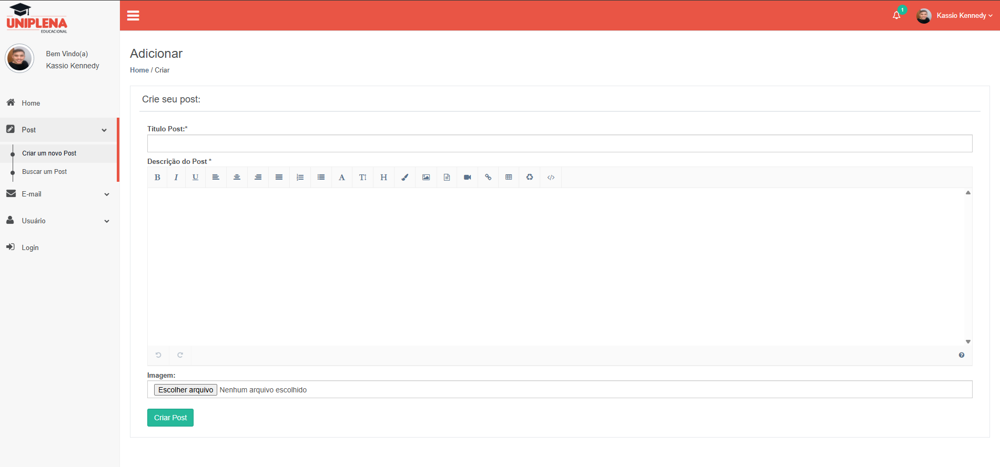
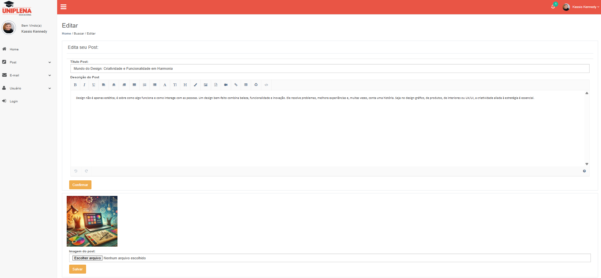

#  Projeto Integrador em Engenharia de Software - PIT 2
 
 Projeto feito para empresa que trabalho e já aproveitei a oportunidade para fazer o da faculdade também. A ideia do projeto e um CRM, um blog do lado do ADM. 

<h3>Tela de login do CRM</h3>

<h3>Home - CRM</h3>

<h3>Criando um Post</h3>

<h3>Buscando um post por parâmetro</h3>

<h3>Visualizando um post</h3>

<h3>Editando um post</h3>

A lógica para Adicionar / Buscar / Ver / Editar / Excluir segue para os outros módulos também.
 

 A ideia desse Blog e disparar o último post para os usuários cadastrados na Newsletter do site

## 🚀 Tecnologias

 Esse projeto foi desenvolvido com as seguindes tecnologias:

 - HTML - CSS/Bootstrap - JavaScript - PHP - MySQL
 - GitHub
 - Visual Studio Code

 - Empresa solicitou esse projeto com intuido de identificar o nível de conhecimento nas tecnologias citadas acima. Aproveitei a oportunidade e fiz junto com projeto acadêmico solicitado pela faculdade!
 ## :memo: Licença 

 Esse projeto está sobre a licença MIT.

